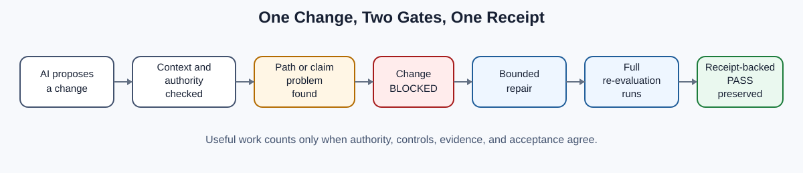

# Tavio Lawrence

## Governed AI Systems Architect

**AI Governance Engineering · Agent Authorization · AI Platform Controls**

I design AI workflows that check permission before a model or agent acts,
preserve blocked actions, recover only through already authorized
alternatives, and produce evidence a reviewer can inspect.

This is an evidence repository. It shows what I built, what happened when a
control said no, how the work recovered without inventing new permission, and
where the evidence stops supporting stronger claims.



My work focuses on a practical question:

> What should an AI-assisted workflow do when useful execution reaches a
> boundary it may not cross?

The differentiator is operational evidence, not governance vocabulary.

```text
permission before consequence
-> refusal preserved under pressure
-> useful recovery without expanded authority
-> evidence that limits the final claim
```

The cases show both sides of the problem: correct controls that preserve
useful progress, and defective controls repaired without erasing the stop.

For a runnable public example, see
[One Change, Two Gates, One Receipt](https://github.com/Secondmindsystems/governed-change-demo).

## Start Here

### [The Agent That Obeyed the Brake](cases/agent-obeyed-the-brake.md)

An active repository control refused one proposed change. The agent did not
bypass the control. It reverted the edit and finished the bounded task through
a recovery route already defined in the plan.

**Why it matters:** the event demonstrates useful recovery after refusal
without new permission.

**Limit:** this is one cooperative local execution, not a claim that every
agent will obey every control.

## Supporting Engineering Evidence

### Operational Campaign case

#### [Persistent Campaigns Without Authority Expansion](cases/persistent-campaigns-without-authority-expansion.md)

A bounded local Codex intake path was adversarially repaired, rechecked,
exercised with one campaign-shaped and one ordinary objective, and accepted
with a documented Windows path limitation. It was published after independent
internal claim and IP review and explicit operator authorization.

### [Authorization Before Inference](proof-summaries/authorization-before-inference.md)

A local AI runtime checked one-use permission before contacting a model,
allowed one call, consumed that permission, and stopped the next attempt before
another model request was sent.

**Capability shown:** authorization design, local-model integration, and
separation between generated text and permission to act.

### [Two Controlled Provider Tests](proof-summaries/two-controlled-provider-tests.md)

A review service completed two separate provider tests: a Stripe test-mode
workflow and, later, one deployed Gemini call. The providers were not live
together, and the service returned to simulated mode after the model test.

**Capability shown:** cloud and provider integration with explicit test
boundaries, evidence persistence, and restoration to simulated mode.

### Technical Deep Dive — Failure-Preserving Integration

#### [When “Permission Required” Was Mistaken for “Permission Granted”](cases/when-permission-required-was-mistaken-for-permission-granted.md)

A repository gate misclassified two non-grant records: one said execution
permission was still required, while the other preserved an earlier state in
which implementation permission had been withheld. The same refusal recorded
a separate receipt-write error. The integration stayed blocked while the
refusal and source records were preserved. A five-path repair corrected the
evaluated classifier behavior, replayed the recorded 127-path staged surface,
and then evaluated the final 132-path staged state.

**Capability shown:** structured authorization-state classification,
controls-as-code, bounded control repair, staged-state replay, and
residual-failure reporting.

**Limit:** this is a local repair completed before any operational AI task or
runtime execution, with internal review—not a production qualification or
universal full-suite pass.

## Why This Matters to Teams

These controls help teams prevent unauthorized AI actions, separate model
output from execution permission, investigate incorrect policy decisions,
preserve auditable failure evidence, and qualify deployment claims before
release.

## Demonstrated Capabilities

| Capability | Evidence |
| --- | --- |
| Authority before consequence | Permission was checked before a local model request was sent. |
| Controls that affect real work | A live pre-commit gate blocked one proposed repository change. |
| Bounded refusal and authorized recovery | A blocked edit was reverted and the task continued only through a route already present in the plan. |
| Structured authorization-state classification | A repository control was repaired to distinguish six present-state meanings and specifically bounded historical records. |
| Failure-preserving control repair | The incorrect refusal and triggering records remained intact while one gate implementation, two existing test modules, and two evidence records were repaired. |
| Staged-state replay and evaluation | The recorded 127-path staged surface was replayed, and the final 132-path staged state was evaluated, with zero blocks or internal errors in both recorded results. |
| Generated output kept inert | Local model output remained review-only text with no tool call or external effect. |
| Cloud and API implementation | Separate Stripe test-mode and deployed Gemini tests crossed real provider interfaces. |
| Deterministic verification | The cases include focused test runs and structured evidence summaries. |
| Claim discipline | Each indexed engineering-event claim carries an evidence class, limitation, and strongest supported conclusion. |

Each case includes its own focused tests and scoped evidence record. Results
are reported separately and are not combined into a system-wide reliability
benchmark.

## Evidence at Two Speeds

If you have thirty seconds, read the flagship case and its limitation.

If you are reviewing the evidence trail, inspect:

- the [public evidence index](evidence/EVIDENCE_INDEX.md);
- the [execution-under-pressure architecture](architecture/governed-execution-under-pressure.md);
- the machine-readable receipts (which preserve their historical candidate
  status) in
  `evidence/public-safe-receipts/`;
- the [evidence method](methods/EVIDENCE_METHOD.md);
- the [claim boundaries](CLAIM_BOUNDARIES.md).

You can also run the
[sanitized packet integrity checker](evidence/verification/README.md), which checks
sanitized receipt hashes, claim identifiers, and claim-level boundary fields.
It fails closed on malformed or missing inputs and emits hashes for its source,
index, receipts, and verified packet snapshot. It verifies the internal
integrity of this public packet, not the underlying private repository events.

Anyone can independently verify the published evidence packet:

```text
git clone https://github.com/Secondmindsystems/governed-ai-systems-portfolio.git
cd governed-ai-systems-portfolio
python tools/verify_public_evidence.py
```

The expected decision is `SANITIZED_PACKET_INTEGRITY_PASS`, covering five
sanitized receipts and 26 public claims. This repository makes independent
verification possible. A recorded outsider reproduction remains pending until
an identifiable reviewer returns the environment, commit, command, and result.

The original implementation and test fixtures are not included, so this
portfolio is not independently reproducible implementation proof. The
portfolio presents three front-door cases and one technical deep dive. Raw
private receipts, source paths, commit identities, and control machinery are
not included.

## What This Portfolio Does Not Claim

These cases show bounded local and deployed-test behavior. They do not
establish production, customer, compliance, adversarial-security, market, or
third-party-validation outcomes. Each case states its exact limit.

The current evidence is strongest in working artifacts, repeated local tests,
and bounded live-context executions.

## Work in Progress

### [What Happened When We Put a Public AI-Governance Control Under External and Adversarial Pressure](cases/governed-change-under-public-pressure.md)

The runnable Governed Change demo publishes an outsider reproduction route, a
named adversarial test pack, bounded local timing evidence, and a passing
public GitHub Actions run. This case remains explicitly in progress until an
identifiable outsider returns a result.

**Current evidence:** published runnable artifacts, local adversarial and
timing results, and public CI success. No outsider reproduction is claimed.

## Authorship and AI Use

Tavio Lawrence defined the objectives, system architecture, authority
boundaries, constraints, acceptance gates, evidence requirements, claim
limits, and integration decisions. AI agents performed bounded
implementation, analysis, drafting, and review work under those controls.
Internal agent review is not represented as independent third-party
validation.

Read the full [authorship statement](methods/AUTHORSHIP_AND_AI_USE.md).

## Role Relevance

This portfolio is designed for work involving:

- AI governance engineering;
- responsible-AI engineering;
- AI platform and runtime architecture;
- agent authorization and policy-engine design;
- controls-as-code, evaluation, and auditability;
- AI solutions implementation;
- technical AI workflow and systems design.

## Contact

**secondmindsystems@gmail.com**

Open to roles and engagements in AI governance engineering, agent
authorization, AI platform controls, and responsible-AI implementation.
Questions about the evidence in this repository are welcome — including
challenges to any claim made here.

Also reachable through the
[Second Mind Systems GitHub profile](https://github.com/Secondmindsystems).

## Use of These Materials

© Second Mind Systems. Published for inspection and evaluation. No license is
granted to copy, modify, redistribute, or reuse these materials except as
permitted by law.
