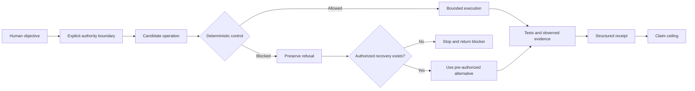

# Governed Execution Under Pressure

This is the public architecture shared by the three front-door cases in this
minimum portfolio. The technical deep dive adds the complementary path for a
control that produces an incorrect refusal.

It explains the capability without exposing private control machinery.



## What Each Stage Means

### Human objective

The system begins with a useful outcome, not with permission to perform any
available action.

### Explicit authority boundary

Allowed actions, prohibited actions, and stop conditions are separated from
technical capability.

### Candidate operation

A model or agent may propose an operation. A proposal is not permission.

### Deterministic control

A control evaluates the proposed operation at the relevant execution
boundary. In the portfolio cases, this may be a repository gate or a
one-use runtime permission check.

### Preserve refusal

When a control blocks an operation, the refusal remains part of the record.
The workflow does not translate the block into success or silently widen its
authority.

### Authorized recovery

Continuation is allowed only when a recovery route already exists inside the
original boundary. Otherwise the correct result is to stop and return the
blocker.

### Tests and observed evidence

The result is evaluated through focused tests, observed provider or runtime
behavior, and structured evidence.

### Claim ceiling

The final statement cannot become stronger than the execution evidence. A
local test remains a local test. A provider test remains a provider test. A
receipt records what happened; it does not create production, customer, or
market validation.

## Architectural Distinctions

```text
capability is not permission
proposal is not execution
refusal is not failure of governance
recovery is not authority expansion
receipt is not validation
technical proof is not market proof
```

## Disclosure Boundary

This diagram is an explanatory abstraction. It does not disclose:

- private rules or scoring systems;
- private control implementation, topology, or bypass-relevant details;
- private repository topology;
- credentials, identifiers, prompts, or provider configuration;
- the complete internal architecture.
