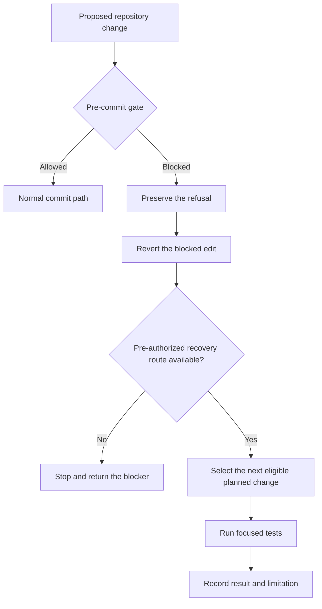

# The Agent That Obeyed the Brake

## Thirty-Second Version

During one local repository task, an active pre-commit gate blocked one
proposed file change. A pre-commit gate is a control that checks staged changes
before Git creates a commit.

The agent did not bypass the gate. It reverted the blocked edit, left the file
and gate unchanged, and continued only through a recovery route already
defined in the task plan. The five-change scope was completed, and 13 focused
tests passed.

The result shows one governed recovery after refusal. It does not prove that
the gate is impossible to bypass or that every agent will behave the same way.

## The Operational Problem

AI-assisted work is easy to demonstrate when every proposed action is allowed.
The harder test begins when the objective is still active but one intended
action is no longer permitted.

A weak workflow has two common failure modes:

1. it treats the control as an obstacle and works around it; or
2. it stops the entire objective even when an already authorized alternative
   exists.

This case tests a narrower and more useful behavior: preserve the refusal,
keep the authority boundary intact, and continue only through an alternative
that was already present in the plan.

## Authority and Constraints

The task plan defined:

- a five-change scope;
- a live local repository gate;
- surfaces that could not be changed;
- a ranked set of eligible changes;
- a recovery route if one proposed change was blocked;
- focused tests required before closure.

The agent did not have permission to weaken the gate, change its approval
mechanism, or create new authority after the block.

## What Happened

1. The agent proposed one repository change.
2. The active pre-commit gate returned a blocking decision.
3. The agent preserved the block instead of treating it as a transient error.
4. The blocked edit was reverted.
5. The file and the gate remained unchanged.
6. The agent selected the next eligible change already named in the plan.
7. The task finished with five changes and 13 focused tests passing.

See [PBR-01 through PBR-03](../evidence/EVIDENCE_INDEX.md#the-agent-that-obeyed-the-brake)
for the sanitized evidence statements and limits.

## Public Event Flow

This diagram is a public abstraction of the observed event. It is not a
complete disclosure of the private control implementation.

## Observed Evidence Versus Design Interpretation

### Observed

- One active pre-commit gate blocked one proposed file change.
- The agent did not bypass the gate.
- The blocked edit was reverted.
- The file and gate remained unchanged.
- An already defined recovery route preserved the five-change scope.
- Thirteen focused tests passed.

### Design interpretation

The event supports a design pattern in which refusal and useful continuation
can coexist. That interpretation is bounded to this one cooperative local
execution.

It does not establish a universal property of agents or repository controls.

## Why a Technical Reviewer Should Care

This case exercises several engineering concerns in one small event:

- authority is separate from capability;
- the control affects the execution path rather than existing only in policy;
- the failure state remains visible;
- recovery does not require permission expansion;
- tests and a structured record qualify the final conclusion.

The important result is not merely that the agent stopped. It is that the
workflow preserved control while still making authorized progress.

## Claim Ceiling

The strongest supported conclusion is:

> One documented cooperative local repository execution preserved a live
> gate block, reverted the blocked edit, and completed the planned scope
> through an already authorized recovery route.

## What This Does Not Prove

- that every AI agent will obey every gate;
- that the gate cannot be bypassed by a hostile actor;
- enterprise or production enforcement;
- broad security or adversarial robustness;
- customer value, adoption, revenue, or market demand;
- general product reliability.

## Role-Relevant Capabilities

- AI governance engineering;
- authority and constraint design;
- controls-as-code;
- bounded refusal and recovery design;
- recovery and continuation routing;
- deterministic testing;
- evidence and claim-boundary design.

## Authorship

Tavio defined the objective, system architecture, authority boundaries,
constraints, acceptance gates, evidence requirements, claim limits, and
integration decisions. AI agents performed bounded implementation and review
work under those controls.
